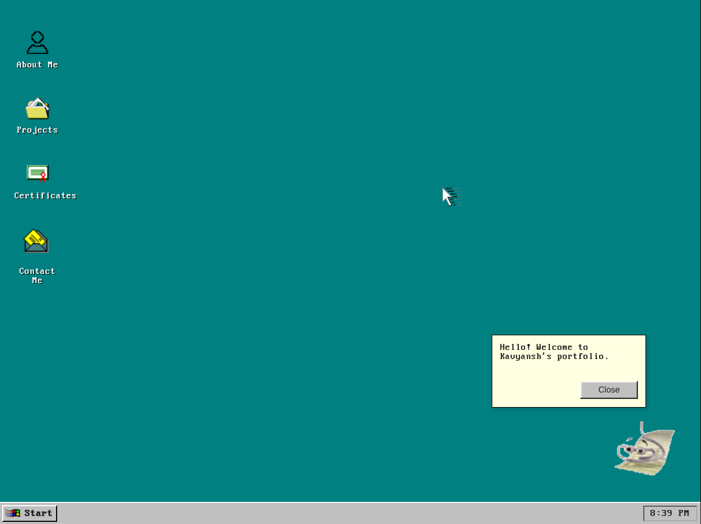

# Windows 95 Style Interactive Portfolio

 

Welcome to my personal portfolio, designed to look and feel like the classic Windows 95 operating system. This project was built from scratch to create a unique and memorable user experience that showcases my projects, certifications, and skills in an interactive desktop environment.

---

## 💡 Project Goals

The primary goal was to step away from traditional, templated portfolios and build something that was not only functional but also demonstrated a deep understanding of JavaScript DOM manipulation, event handling, and core CSS layout principles. It was a fun challenge to replicate the behavior of a desktop OS within the constraints of a web browser.

---

## ✨ Key Features

* **Retro Win95 UI**: A faithful recreation of the classic desktop, taskbar, start menu, and window elements using the [98.css](https://jdan.github.io/98.css/) library and custom styling.
* **Interactive Desktop Environment**: Open applications, move windows, and interact with the interface just like a real OS.
* **Draggable & Resizable Windows**: All windows, including "About Me," "Projects," and "Certificates," can be dragged around the desktop and resized.
* **Dynamic Content**: Project, certificate, and contact information is loaded dynamically from a single `portfolioData.json` file.
* **Built-in "Applications"**: Includes several fun, interactive apps:
    * A fully functional **Snake** game 🐍
    * A simple **Paint** program 🎨
    * A simulated **MS-DOS** command prompt that recognizes commands.
* **Easter Eggs**: Explore the desktop to find hidden surprises!

---

## 🛠️ Technologies Used

This project was built from the ground up with a focus on core web technologies, without relying on any major frameworks.

* **Frontend**: JavaScript (ES6), HTML5, CSS3
* **Data Handling**: JSON for dynamically loading content.
* **Styling**: A combination of custom CSS and the [98.css](https://jdan.github.io/98.css/) library for the retro aesthetic.

---

## 🚀 How to Run Locally

To explore this project on your local machine, follow these simple steps:

1.  **Clone the repository:**
    ```bash
    git clone [https://github.com/your-username/your-repo-name.git](https://github.com/your-username/your-repo-name.git)
    ```
2.  **Navigate to the project directory:**
    ```bash
    cd your-repo-name
    ```
3.  **Open `index.html`:**
    * Simply open the `index.html` file in your favorite web browser.
    * For the best experience (to allow JSON data fetching), it's recommended to use a simple local server. If you have VS Code, you can use the "Live Server" extension.

---

